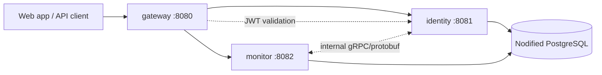

# Nodified

Nodified is a developer-friendly platform for building and using operational tools. It provides the shared foundation that future Nodified applications can use: an edge API, identity, organizations/workspaces, access control, and common deployment conventions.

**API Monitoring is Nodified's first application**, not the definition of the whole platform. It will let developers register endpoints, track availability and performance, and respond to failures. Future developer-focused applications can be added to Nodified without rebuilding the platform foundation.

This repository currently establishes the production-shaped boundaries and build system only; it does not yet implement users, API monitoring checks, authentication flows, alerting, or a frontend.

## Architecture at a glance



The arrows describe the intended architecture for the Nodified platform and its first application. At this stage the applications start independently but do not yet expose the business routes or gRPC implementations represented in the diagram.

## Platform foundation and first application

| Service | Responsibility | Storage and integration | Public role |
| --- | --- | --- | --- |
| `gateway` | Platform edge entry point for browser and API clients. It will own request routing, cross-cutting HTTP policy, and JWT validation. | Stateless. It validates bearer tokens using the configured issuer. | The only service intended to be exposed publicly in a deployed environment. |
| `identity` | Platform identity and account boundary. It will own user accounts, organizations/workspaces, credentials, roles, and token issuance for Nodified applications. | Owns the `identity` PostgreSQL schema and its Flyway migration history. | Reached through the gateway; not exposed directly in production. |
| `monitor` | The API Monitoring application boundary. It will own monitored targets, check schedules, check results, incident state, and notification orchestration. | Owns the `monitor` PostgreSQL schema and its Flyway migration history. Defines protobuf contracts for internal service-to-service communication. | Reached through the gateway; not exposed directly in production. |

Each service is independently deployable: it has its own Spring Boot entry point, Gradle module, configuration file, test source tree, and Dockerfile. Keeping these boundaries explicit prevents either service from reading the other service's database or importing its internal implementation.

## Intended request and data flows

### Client API flow

1. A client calls the public gateway.
2. The gateway authenticates the request using a JWT whose issuer is configured by `JWT_ISSUER_URI`.
3. The gateway routes identity-oriented operations to `identity` and monitoring-oriented operations to `monitor`.
4. The destination service enforces its own authorization and performs work within its own domain and database.

### API Monitoring flow

1. A future monitoring worker selects a due check owned by `monitor`.
2. It calls the customer API, then records the outcome, timing, and error details in the monitor database.
3. It evaluates alerting rules and creates or updates an incident when required.
4. Other services can use the versioned `monitor.proto` contract for typed internal communication instead of sharing database tables.

Redis is deliberately not included yet. It can be introduced when the worker/scheduling design demonstrates a concrete need for distributed queues, locks, or short-lived caching.

## Data ownership and migrations

Nodified uses one PostgreSQL host and one database, named `nodified` by default. The database is divided into service-owned schemas:

```text
nodified
├── identity  # owned and migrated only by identity
└── monitor   # owned and migrated only by monitor
```

No service may query another service's schema. Cross-service needs should be satisfied by APIs, versioned gRPC contracts, or events added later. Each schema is migrated only by its owning service through Flyway scripts placed in:

```text
services/apps/identity/src/main/resources/db/migration/
services/apps/monitor/src/main/resources/db/migration/
```

The folders are intentionally empty until domain tables are designed. Each service configures Hibernate's default schema and Flyway's schema explicitly. Flyway creates the service schema when the database user has permission; Hibernate is configured with `ddl-auto: validate`, so it will validate an existing schema rather than silently create or alter production tables.

## Supabase database for production

Nodified uses Supabase as its hosted PostgreSQL provider. Create one Supabase project and use its default `postgres` database as the shared `nodified` database connection; Flyway will create and manage the `identity` and `monitor` schemas inside it.

For a deployed Spring Boot application, open **Connect** in the Supabase dashboard and use the **Session pooler** JDBC connection on port `5432`. Do not use the Transaction pooler on port `6543` for these services: Hibernate relies on prepared statements, which require a session connection. Ensure the JDBC URL includes `sslmode=require`.

Configure the deployment platform with the values from the Supabase Connect dialog:

```text
SPRING_PROFILES_ACTIVE=prod
NODIFIED_DB_URL=jdbc:postgresql://<pooler-host>:5432/postgres?sslmode=require
NODIFIED_DB_USERNAME=postgres.<project-reference>
NODIFIED_DB_PASSWORD=<database-password>
JWT_ISSUER_URI=<your-identity-issuer-url>
```

Never commit these values. Add them only in your hosting provider's environment-variable or secret settings.

Supabase's Free plan can pause an inactive project. A paused project keeps its data and configuration and can be resumed from the dashboard for up to one year. It is suitable for development and an MVP, but use a paid plan or an independent backup strategy before relying on it for data that cannot tolerate a prolonged outage or loss.

## Repository layout

```text
nodified/
├── services/
│   └── apps/
│       ├── gateway/       # Nodified platform edge service
│       ├── identity/      # Nodified platform identity service and migrations
│       └── monitor/       # API Monitoring application, migrations, and protobuf contracts
├── libraries/             # Reserved for stable shared libraries; empty by design
├── deployment/            # Reserved for shared deployment/infrastructure assets; empty by design
├── build.gradle           # Root plugin and repository configuration
├── settings.gradle        # Gradle module declarations
├── gradlew                # Pinned Gradle Wrapper
└── .env.example           # Safe local configuration template
```

Shared code should be added to `libraries` only when it is genuinely domain-neutral and has a stable API. Do not move service entities, repositories, or domain rules into a shared library merely to avoid duplication.

## Technology baseline

- Java 21
- Spring Boot 4.1.0 and Gradle 9.6.1
- Spring Web, Validation, Security resource server, Actuator, Lombok, and OpenAPI
- Spring Data JPA, PostgreSQL JDBC, and Flyway in `identity` and `monitor`
- Protocol Buffers and gRPC Java in `monitor`
- One Dockerfile per deployable application

## Environment configuration

Every service has a shared `application.yml` plus two environment-specific configuration files:

| Profile | File | Purpose |
| --- | --- | --- |
| `local` | `application-local.yml` | Default for development on your computer. It includes safe localhost defaults. |
| `prod` | `application-prod.yml` | Used after deployment. It has no database or JWT defaults, so deployment must provide every required environment variable. |

`local` is used by default. Start a deployed application with `SPRING_PROFILES_ACTIVE=prod`. The name `local` is intentional: Spring's `test` profile remains available later for automated test configuration.

Applications read configuration from environment variables; no secrets are committed. Copy or use [`.env.example`](.env.example) as the list of local variables.

### Connecting local development to Supabase

The `identity` and `monitor` local profiles use this fallback when no database environment variable is supplied:

```text
jdbc:postgresql://localhost:5432/nodified
```

To use your new Supabase database while developing locally, set these three environment variables instead. They override the localhost fallback:

```text
NODIFIED_DB_URL=jdbc:postgresql://<session-pooler-host>:5432/postgres?sslmode=require
NODIFIED_DB_USERNAME=postgres.<project-reference>
NODIFIED_DB_PASSWORD=<database-password>
```

Find the exact values in **Supabase Dashboard → Connect → Session pooler → JDBC**:

| Nodified variable | Copy from Supabase |
| --- | --- |
| `NODIFIED_DB_URL` | The JDBC host and port. Use port `5432`, database name `postgres`, and add `?sslmode=require`. |
| `NODIFIED_DB_USERNAME` | The username shown in the connection string, commonly `postgres.<project-reference>`. |
| `NODIFIED_DB_PASSWORD` | The database password chosen while creating the project. Reset it in **Project Settings → Database** if you no longer have it. |

The connection URL, username, and password are all sensitive. Do not paste them into a chat, commit them to Git, or add them directly to a YAML file. A `.env` file is not automatically loaded by Spring Boot; export the variables in your terminal, configure them in your IDE, or pass them through Docker/your deployment platform.

| Variable | Used by | Purpose |
| --- | --- | --- |
| `JWT_ISSUER_URI` | All services | JWT issuer URI for resource-server validation. |
| `NODIFIED_DB_URL`, `NODIFIED_DB_USERNAME`, `NODIFIED_DB_PASSWORD` | `identity`, `monitor` | Shared PostgreSQL database connection; each service is confined to its own configured schema. |
| `FLYWAY_ENABLED` | `identity`, `monitor` | Enables or disables migrations for a specific environment. |
| `SERVER_PORT` | Each service | Overrides that application's HTTP port. |

Default development ports are `8080` for gateway, `8081` for identity, and `8082` for monitor. PostgreSQL is required only when running `identity` or `monitor`; it is not required to compile or package the project.

## Build, run, and package

```bash
./gradlew build

./gradlew :services:apps:gateway:bootRun
./gradlew :services:apps:identity:bootRun
./gradlew :services:apps:monitor:bootRun

./gradlew :services:apps:gateway:bootJar
./gradlew :services:apps:identity:bootJar
./gradlew :services:apps:monitor:bootJar
```

Run a service with its production configuration:

```bash
SPRING_PROFILES_ACTIVE=prod ./gradlew :services:apps:monitor:bootRun
```

Build a service image from the repository root, so Docker can access the shared Gradle build files:

```bash
docker build -f services/apps/gateway/Dockerfile -t nodified-gateway .
```

## Deliberately not implemented yet

This scaffold does not yet include API routing rules, database schema migrations, registration/login/token issuance, role or workspace isolation, API Monitoring workers, scheduling, alert delivery, Redis, an event broker, or a frontend. Those capabilities should be added behind the platform and application boundaries documented above rather than by introducing direct database coupling.
