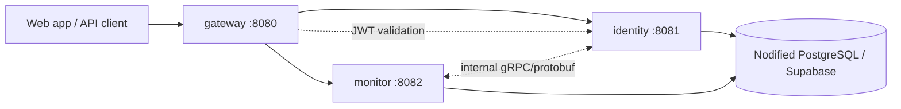

# Nodified

Nodified is a developer-friendly platform for building and using operational tools. It provides the shared foundation that future Nodified applications can use: an edge API, identity, organizations/workspaces, access control, and common deployment conventions.

**API Monitoring is Nodified's first application**, not the definition of the whole platform. It will let developers register endpoints, track availability and performance, and respond to failures. Future developer-focused applications can be added to Nodified without rebuilding the platform foundation.

This repository establishes the production-shaped boundaries and build system: independent services, separate database credentials and schemas, Hibernate auto-DDL schema management, Docker packaging, and edge routing.

## Architecture at a glance



## Platform Foundation & Services

| Service | Responsibility | Storage & Database Schema | Public Port |
| :--- | :--- | :--- | :--- |
| `gateway` | Platform edge entry point for browser and API clients. Owns request routing, cross-cutting HTTP policy, and JWT validation. | Stateless. Validates bearer tokens using the configured issuer. | `:8080` (Only service exposed publicly) |
| `identity` | Platform identity, organizations, accounts, credentials, roles, and token issuance. | Owns the `identity` PostgreSQL schema. Schema managed via Hibernate DDL auto-update. | `:8081` (Internal / Edge-routed) |
| `monitor` | API Monitoring application. Owns targets, check schedules, results, incident states, and alerts. | Owns the `monitor` PostgreSQL schema. Schema managed via Hibernate DDL auto-update. | `:8082` (Internal / Edge-routed) |

Each service is **strictly isolated**:
- Has its own Spring Boot entry point, Gradle module, and configuration.
- Uses **its own dedicated environment variables** (no shared database variables).
- Operates inside its own PostgreSQL schema (`identity` and `monitor` respectively).
- Generates its own standalone executable JAR and lightweight Docker container.

---

## Database Architecture & Schema Isolation

Nodified supports both **shared PostgreSQL instances (like Supabase)** with isolated schemas, as well as **completely independent databases** deployed across different networks and cloud providers.

```text
PostgreSQL Database ('postgres' or dedicated DBs)
├── identity schema   # Owned, created, and updated ONLY by identity service
│   └── (identity tables...)
└── monitor schema    # Owned, created, and updated ONLY by monitor service
    └── (monitor tables...)
```

### Key Highlights:
1. **Automatic Schema Initialization**: Each service automatically ensures its target schema (`identity` / `monitor`) exists upon connecting using `DatabaseSchemaInitializer`.
2. **Hibernate DDL Auto-Update**: Schemas and tables are automatically updated by Hibernate (`spring.jpa.hibernate.ddl-auto: update`).

---

## Environment Configuration

Every service provides profile-based configurations (`application.yml`, `application-local.yml`, and `application-prod.yml`).

### Dedicated Service Variables

| Variable | Service | Description | Default Local |
| :--- | :--- | :--- | :--- |
| `GATEWAY_PORT` | `gateway` | HTTP Server Port | `8080` |
| `GATEWAY_JWT_ISSUER_URI` | `gateway` | JWT Issuer URI for token verification | `http://localhost:8081` |
| `IDENTITY_PORT` | `identity` | HTTP Server Port | `8081` |
| `IDENTITY_DB_URL` | `identity` | PostgreSQL JDBC Connection URL | `jdbc:postgresql://localhost:5432/nodified` |
| `IDENTITY_DB_USERNAME` | `identity` | Database Username | `nodified` |
| `IDENTITY_DB_PASSWORD` | `identity` | Database Password | `nodified` |
| `IDENTITY_DB_SCHEMA` | `identity` | PostgreSQL Schema | `identity` |
| `IDENTITY_DDL_AUTO` | `identity` | Hibernate DDL Auto strategy | `update` |
| `IDENTITY_JWT_ISSUER_URI`| `identity` | JWT Issuer URI | `http://localhost:8081` |
| `MONITOR_PORT` | `monitor` | HTTP Server Port | `8082` |
| `MONITOR_DB_URL` | `monitor` | PostgreSQL JDBC Connection URL | `jdbc:postgresql://localhost:5432/nodified` |
| `MONITOR_DB_USERNAME` | `monitor` | Database Username | `nodified` |
| `MONITOR_DB_PASSWORD` | `monitor` | Database Password | `nodified` |
| `MONITOR_DB_SCHEMA` | `monitor` | PostgreSQL Schema | `monitor` |
| `MONITOR_DDL_AUTO` | `monitor` | Hibernate DDL Auto strategy | `update` |
| `MONITOR_JWT_ISSUER_URI` | `monitor` | JWT Issuer URI | `http://localhost:8081` |

---

## Running Locally

### 1. Run with Docker Compose (Recommended)

Build all executable JARs and start the containerized stack:

```bash
# 1. Build executable JARs
./gradlew bootJar

# 2. Start all services in the background
docker compose -f deployment/docker-compose.yml up --build -d
```

#### Mapped Endpoints:
- **Gateway**: `http://localhost:8080`
- **Identity (Swagger UI)**: `http://localhost:8081/swagger-ui.html`
- **Monitor**: `http://localhost:8082`

#### Useful Compose Commands:
```bash
# View live logs across all services
docker compose -f deployment/docker-compose.yml logs -f

# Stop all services
docker compose -f deployment/docker-compose.yml down
```

---

### 2. Run Directly via Gradle

Export your local `.env` variables and run the services in separate terminal sessions:

```bash
export $(grep -v '^#' .env | xargs)

# Terminal 1: Gateway
./gradlew :services:apps:gateway:bootRun

# Terminal 2: Identity
./gradlew :services:apps:identity:bootRun

# Terminal 3: Monitor
./gradlew :services:apps:monitor:bootRun
```

---

### 3. Run Executable JARs Directly

```bash
./gradlew bootJar

java -jar services/apps/gateway/build/libs/gateway-0.1.0-SNAPSHOT.jar
java -jar services/apps/identity/build/libs/identity-0.1.0-SNAPSHOT.jar
java -jar services/apps/monitor/build/libs/monitor-0.1.0-SNAPSHOT.jar
```

---

## Repository Layout

```text
nodified/
├── gradle/
│   └── libs.versions.toml # Centralized dependency & version catalog
├── services/
│   └── apps/
│       ├── gateway/       # Platform edge service, routing & JWT validation
│       ├── identity/      # Platform identity service, accounts, and auth
│       └── monitor/       # API Monitoring application, checks & protobuf contracts
├── deployment/
│   └── docker-compose.yml # Compose configuration with local mapped ports
├── libraries/             # Reserved for stable domain-neutral shared libraries
├── build.gradle           # Root Gradle build configuration
├── settings.gradle        # Multi-project module declarations
├── gradlew                # Pinned Gradle Wrapper
├── .env.example           # Safe configuration template
└── README.md
```

## Technology Baseline

- **Java**: 21 (Eclipse Temurin)
- **Framework**: Spring Boot 4.1.0 & Gradle 9.6.1
- **Persistence**: Spring Data JPA (Hibernate auto-DDL update), PostgreSQL JDBC Driver
- **Security**: Spring Security 7 OAuth2 Resource Server
- **Contracts**: Protocol Buffers & gRPC Java (in `monitor`)
- **Containers**: Eclipse Temurin 21 JRE runtime images
