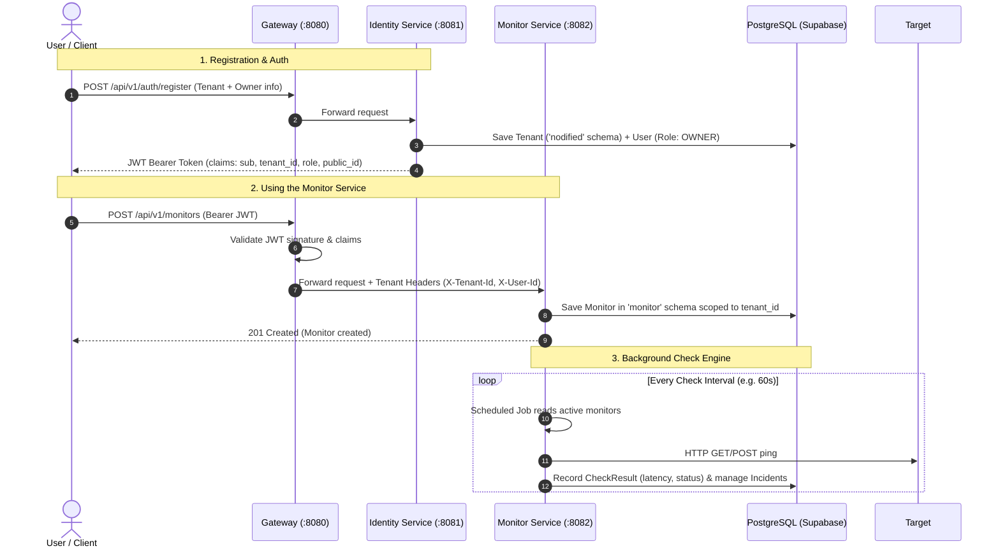

# Nodified: End-to-End Implementation Roadmap & Architecture Plan

This document outlines the complete step-by-step roadmap to take **Nodified** from its current scaffolding to a fully working, production-shaped multi-tenant API monitoring platform.

---

## 1. System Architecture & Auth Flow



---

## 2. Multi-Tenancy & Data Isolation Model

Nodified uses **application-level multi-tenancy and data isolation**:
1. **Schema-Level Isolation across Services**:
   - `identity` schema: Owns users, credentials, organizations/tenants, and role assignments.
   - `monitor` schema: Owns monitoring targets, HTTP check schedules, ping results, and incidents.
2. **Tenant Scoping within Service Schemas (`tenant_id`)**:
   - Every multi-tenant entity contains a `tenant_id` (UUID) column.
   - **Repository Query Guideline**: Always use `findBy<xxx>AndTenantId` (or `findByTenantId...`) in Spring Data JPA repositories for all lookup, update, and delete queries to ensure strict tenant data isolation and prevent cross-tenant data leaks.
   - No database-level RLS is used; all tenant scoping is handled cleanly and explicitly at the application/repository level.

---

## 3. Phase-by-Phase Implementation Checklist

### Phase 1: Identity Service — Tenant & User Registration + Login

- [ ] **1.1. Security Configuration & Password Hashing**
  - File: `services/apps/identity/src/main/java/com/nodified/identity/config/SecurityConfig.java`
  - Define `PasswordEncoder` (`BCryptPasswordEncoder`) bean.
  - Permit unauthenticated access to `/api/v1/auth/**`, `/actuator/**`, `/swagger-ui/**`.
  - Configure stateless session management (`SessionCreationPolicy.STATELESS`).

- [ ] **1.2. JWT Token Service**
  - Files: `.../service/JwtService.java`, `.../service/impl/JwtServiceImpl.java`
  - Generate HMAC-SHA256 (or RSA) signed JWTs.
  - Include essential claims:
    - `sub`: User Public ID (`usr_...`)
    - `userId`: User UUID
    - `tenantId`: Tenant UUID
    - `tenantKey`: Tenant Slug / Key
    - `role`: User Role (`OWNER`, `ADMIN`, `MEMBER`)
  - Implement token validation and claims parsing.

- [ ] **1.3. Tenant & User DTOs**
  - `RegisterRequest`: `tenantKey`, `tenantName`, `firstName`, `lastName`, `username`, `password`
  - `LoginRequest`: `username`, `password`
  - `AuthResponse`: `accessToken`, `tokenType`, `expiresIn`, `user` (`publicId`, `username`, `role`), `tenant` (`publicId`, `key`, `name`)
  - `UserResponse`: Public user representation.

- [ ] **1.4. User & Tenant Onboarding Service**
  - File: `services/apps/identity/src/main/java/com/nodified/identity/service/impl/UserServiceImpl.java`
  - `register(RegisterRequest)`:
    - Validate uniqueness of `tenantKey` and `username`.
    - Create and persist `TenantAccounts`.
    - Hash password with BCrypt.
    - Create `UserAccounts` assigned to the new tenant with role `OWNER`.
    - Generate and return JWT auth response.
  - `login(LoginRequest)`:
    - Look up user by username.
    - Verify password via `passwordEncoder.matches()`.
    - Return signed JWT auth response.

- [ ] **1.5. Auth Endpoints**
  - File: `services/apps/identity/src/main/java/com/nodified/identity/controller/AuthController.java`
  - `POST /api/v1/auth/register`
  - `POST /api/v1/auth/login`

---

### Phase 2: Identity Service — Roles, Authorities & User Management

- [ ] **2.1. Role Model & Schema Update**
  - Add `Role` enum (`OWNER`, `ADMIN`, `MEMBER`) to `UserAccounts`.
  - Add `isActive` flag (default `true`) to handle disabled accounts.

- [ ] **2.2. JWT Filter & Security Context Authentication**
  - File: `services/apps/identity/src/main/java/com/nodified/identity/filter/JwtFilter.java`
  - Extract `Bearer <token>` from `Authorization` header.
  - Validate token and populate Spring `SecurityContextHolder` with `UsernamePasswordAuthenticationToken` containing user authorities (`ROLE_OWNER`, etc.).

- [ ] **2.3. User & Tenant Management Endpoints**
  - File: `services/apps/identity/src/main/java/com/nodified/identity/controller/UserController.java`
  - `GET /api/v1/users/me`: Return profile and tenant of the current authenticated user.
  - `POST /api/v1/users/invite`: (Role `OWNER`/`ADMIN` only) Add a new user under the current tenant.

---

### Phase 3: Gateway Service — Routing & Edge Security

- [ ] **3.1. Reverse Proxy / Gateway Routes**
  - File: `services/apps/gateway/src/main/resources/application.yml`
  - Route `/api/v1/auth/**`, `/api/v1/users/**` -> `http://identity:8081` (or `localhost:8081` in local profile).
  - Route `/api/v1/monitors/**`, `/api/v1/incidents/**` -> `http://monitor:8082` (or `localhost:8082` in local profile).

- [ ] **3.2. Gateway Token Validation & Header Propagation**
  - Gateway validates JWT and forwards authenticated context headers:
    - `X-Tenant-Id`: `<tenant-uuid>`
    - `X-User-Id`: `<user-uuid>`
    - `X-User-Role`: `<role>`

---

### Phase 4: Monitor Service — Multi-Tenant Schema & Entities

- [ ] **4.1. Domain Entities (`monitor` PostgreSQL schema)**
  - **`MonitorTarget`** (Table: `monitor.monitors`):
    - `id` (UUID), `publicId` (`mon_...`)
    - `tenantId` (UUID, indexed for tenant isolation)
    - `name` (String, e.g. "Payment API Ping")
    - `url` (String, e.g. "https://api.example.com/health")
    - `httpMethod` (GET, POST, HEAD)
    - `intervalSeconds` (int, e.g. 60, 300)
    - `expectedStatusCode` (int, e.g. 200)
    - `timeoutMs` (int, default 5000)
    - `status` (UP, DOWN, UNKNOWN)
    - `isActive` (boolean)
    - `lastCheckedAt` (Timestamp)
  - **`CheckResult`** (Table: `monitor.check_results`):
    - `id` (UUID)
    - `tenantId` (UUID, indexed)
    - `monitorId` (UUID, foreign key / indexed)
    - `statusCode` (int)
    - `responseTimeMs` (long)
    - `isSuccess` (boolean)
    - `errorMessage` (String, nullable)
    - `checkedAt` (Timestamp)
  - **`Incident`** (Table: `monitor.incidents`):
    - `id` (UUID), `publicId` (`inc_...`)
    - `tenantId` (UUID)
    - `monitorId` (UUID)
    - `status` (OPEN, RESOLVED)
    - `startedAt` (Timestamp)
    - `resolvedAt` (Timestamp, nullable)
    - `summary` (String)

- [ ] **4.2. Multi-Tenant Repositories**
  - `MonitorRepository`: `findAllByTenantIdAndIsActiveTrue()`, `findByIdAndTenantId()`, `findAllByTenantId(Pageable)`
  - `CheckResultRepository`: `findAllByMonitorIdAndTenantIdOrderByCheckedAtDesc(UUID monitorId, UUID tenantId, Pageable)`
  - `IncidentRepository`: `findAllByTenantIdOrderByStartedAtDesc(UUID tenantId)`

---

### Phase 5: Monitor Service — Background Check Engine & REST APIs

- [ ] **5.1. Tenant Context Interceptor / Filter**
  - Read `tenantId` from JWT claim or propagated `X-Tenant-Id` header and bind to a `TenantContext` ThreadLocal.

- [ ] **5.2. Lightweight HTTP Check Engine**
  - Use Java 21 `HttpClient` / Spring `RestClient` (zero extra dependencies).
  - Background Scheduler (`@Scheduled(fixedDelay = 10000)` or virtual-thread executor):
    - Query active monitors due for a check (`lastCheckedAt + intervalSeconds <= now`).
    - Execute non-blocking HTTP ping with timeout.
    - Measure latency and status code match.
    - Persist `CheckResult`.
    - Trigger incident transition:
      - Fail -> If no open incident, create `OPEN` incident and mark monitor `DOWN`.
      - Recover -> If open incident exists, mark `RESOLVED` and mark monitor `UP`.

- [ ] **5.3. Monitor Management REST APIs**
  - `POST /api/v1/monitors`: Create a new monitor for the tenant.
  - `GET /api/v1/monitors`: List all monitors with current uptime status and latest latency.
  - `GET /api/v1/monitors/{publicId}`: Get single monitor details.
  - `GET /api/v1/monitors/{publicId}/results`: Get latency & response history for charts.
  - `GET /api/v1/incidents`: List tenant incidents.
  - `PUT /api/v1/monitors/{publicId}`: Update URL, frequency, or pause/resume.
  - `DELETE /api/v1/monitors/{publicId}`: Soft-delete or remove monitor.

---

## 4. End-to-End Verification Runbook

When implementation is complete, run this verification script using `curl`:

```bash
# 1. Register a new Tenant and Admin User
curl -X POST http://localhost:8080/api/v1/auth/register \
  -H "Content-Type: application/json" \
  -d '{
    "tenantKey": "acme-corp",
    "tenantName": "Acme Corporation",
    "firstName": "Jane",
    "lastName": "Doe",
    "username": "jane@acme.com",
    "password": "SecurePassword123!"
  }'

# (Save the returned JWT token into an environment variable)
export TOKEN="<PASTE_JWT_TOKEN_HERE>"

# 2. Check current user profile
curl -X GET http://localhost:8080/api/v1/users/me \
  -H "Authorization: Bearer $TOKEN"

# 3. Create a monitored target (HTTP Ping)
curl -X POST http://localhost:8080/api/v1/monitors \
  -H "Authorization: Bearer $TOKEN" \
  -H "Content-Type: application/json" \
  -d '{
    "name": "HTTPBin Health Check",
    "url": "https://httpbin.org/status/200",
    "httpMethod": "GET",
    "intervalSeconds": 30,
    "expectedStatusCode": 200,
    "timeoutMs": 3000
  }'

# 4. List monitors & see live ping status
curl -X GET http://localhost:8080/api/v1/monitors \
  -H "Authorization: Bearer $TOKEN"

# 5. Inspect latency metrics & recent checks
curl -X GET http://localhost:8080/api/v1/monitors/mon_xxxxxxxxxxxx/results \
  -H "Authorization: Bearer $TOKEN"
```
